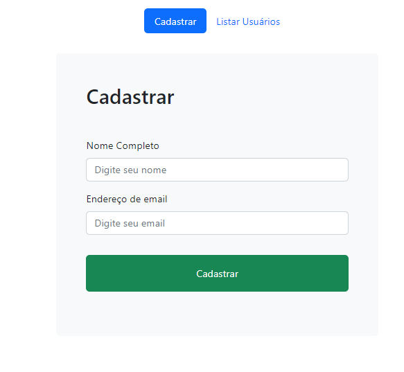
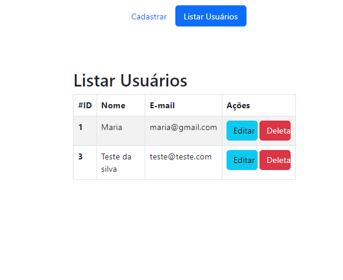
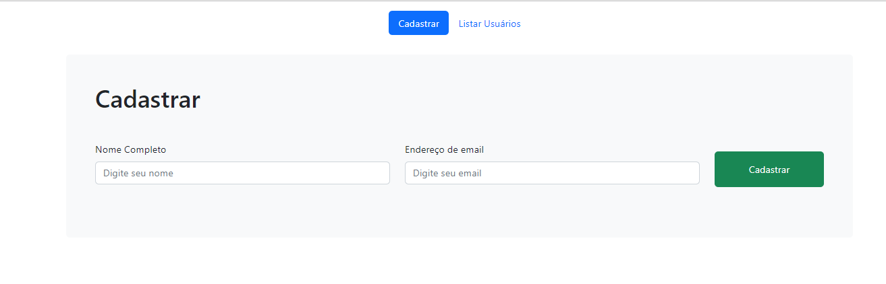
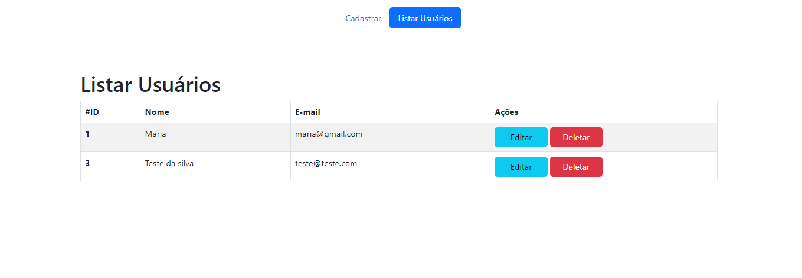

# 🚧​ CRUD Node com Handlebars
O desenvolvimento desse projeto faz parte de uma aula no YouTube, do canal [Programação Web](https://www.youtube.com/channel/UCwAa6VoM1GCg7n4s3u9FTAg), onde eu teria que desenvolver um **CRUD** utilizando Node Js como backend e MySQL como banco de dados.  

## 🎨 Layout
### Layout mobile

<div align="center" >
	 
	
</div>
 
### Layout web

<div align="center" >
  
  
</div>


## 💻​ Tecnologias
- [Handlebars](https://handlebarsjs.com/)
- [Sequelize](https://sequelize.org/)
- [Bootstrap](https://getbootstrap.com/)
- [Node](https://nodejs.org/en/)
- [Xampp](https://www.apachefriends.org/download.html)

## 🚀 Como executar o projeto
### Requisitos
- Necessário ter baixado em sua maquina as ferramentas: [Git](https://nodejs.org/en/) e [Node.js](https://nodejs.org/en/);
- Baixar um editor de texto para executar os codigos como [VSCode](https://code.visualstudio.com/);
- Baixar o aplicativo [Xampp](https://www.apachefriends.org/download.html) para ter o banco de dados MySQL em seu computador;
- Abra o Xampp e inicialize o Apache e o MySQL (eles ficam verdinhos depois de inicializados);
- Clique em "Admin" do MySQL e você vai para o PHPMyAdmin;
- Dentro do PHPMyAdmin clique em "Novo" no canto esquerdo para criar um novo banco;
- Coloque o nome da base de dados crud-nodehandlebars e clique em criar;
- Agora abra o projeto no VSCode. Aperte CTRL + ' (aspas simples) que vai abrir o terminal.

### 🎲 Rodando o Front End e o Back End
```bash
# Clone este repositório
$ git clone https://github.com/daianaadepaula/crud-nodehandlebars.git

# Instale as dependências
$ npm install dentro da pasta crud-nodehandlebars

# Execute a aplicação
$ npm run dev dentro da pasta crud-nodehandlebars

Obs: Não esqueça de configurar o arquivo database pois a conexão com o banco de dados é necessária.

# O servidor Front End inciará na porta:3001 - acesse http://localhost:3001
```

## 🌎​ Contribuição

<table>
  <tr>
    <td align="center">
      <a href="#">
        
		<br>
        <sub>
          <b>Daiana de Paula</b>
		  <br>
          <a href="https://www.instagram.com/daianaadepaula_/">Instagram</a>
		  &nbsp;|&nbsp;
		  <a href="https://github.com/daianaadepaula">GitHub</a>
		  &nbsp;|&nbsp;
		  <a href="https://www.linkedin.com/in/daianadepaula/">LinkedIn</a>
        </sub>
      </a>
    </td>    
</table>

## 📝 Licença
[](https://github.com/daianaadepaula/crud-nodehandlebars/blob/master/LICENSE)


